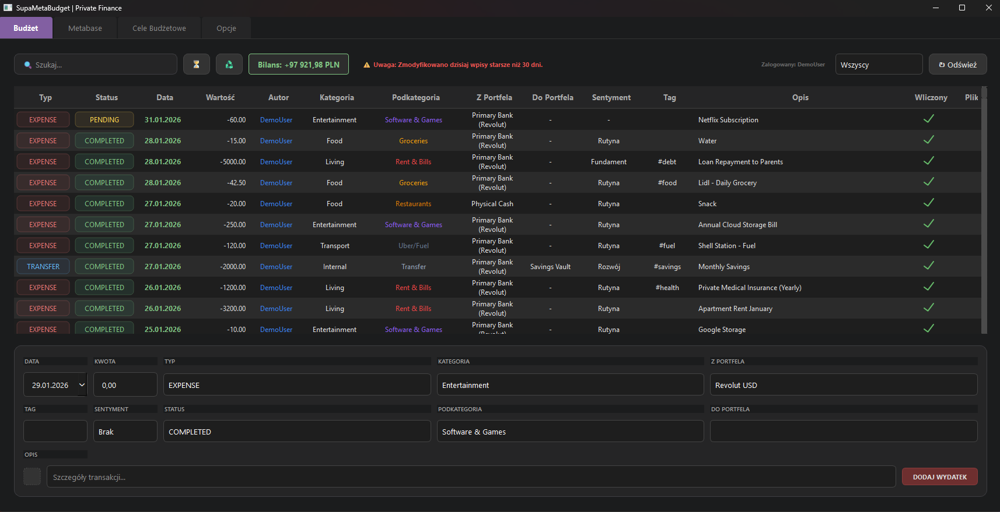
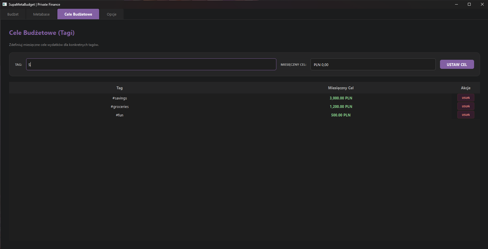
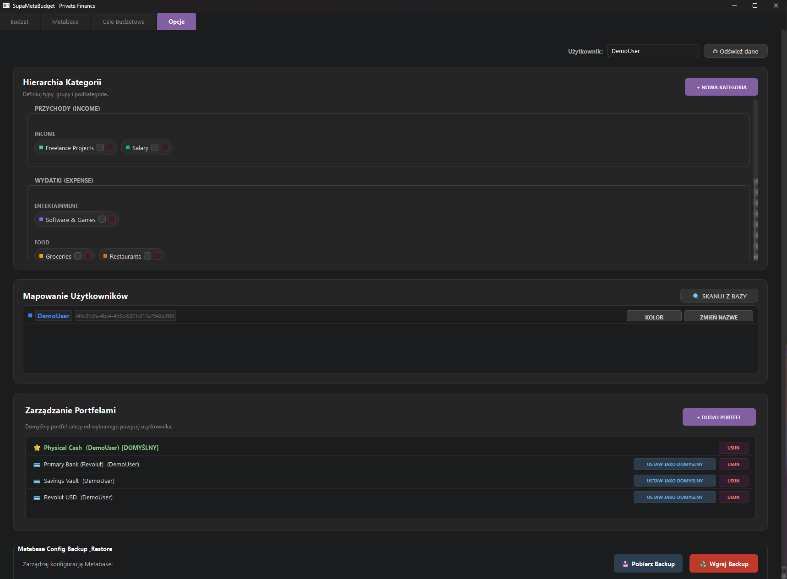
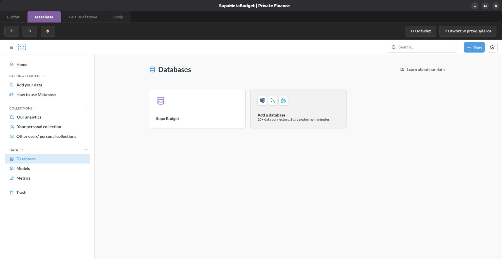
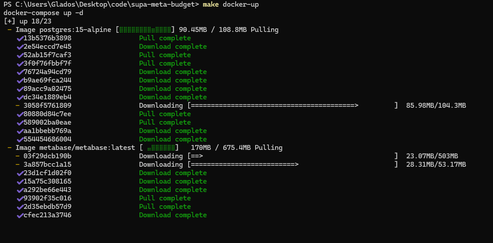
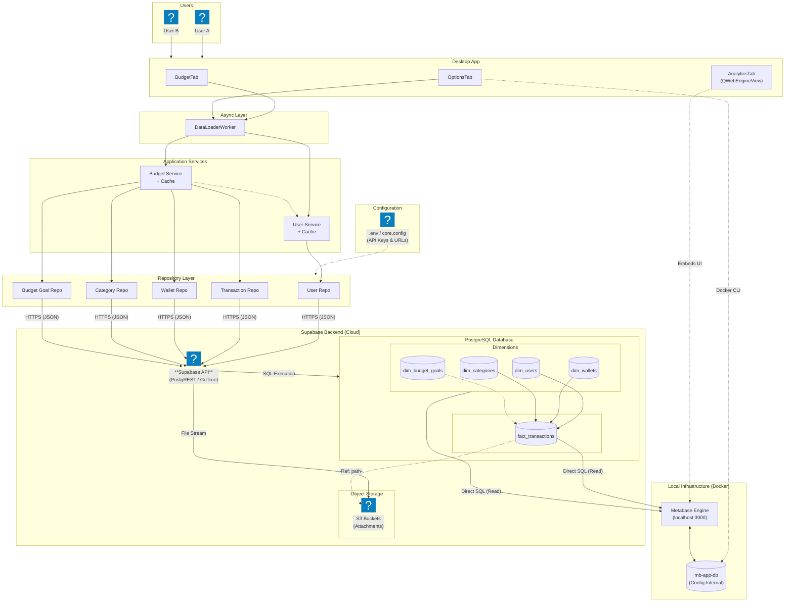

# Supa-Meta-Budget

A desktop application designed for managing personal and household finances. It provides a clean interface for tracking daily expenses, incomes, and transfers, backed by a cloud database for data safety and accessibility.

**Status:** Active Development / Beta

---

## Application Previews

### 1. Main Interface

The central hub for managing transactions, viewing daily entries, and monitoring account balances.



### 2. Goal Tracking

Set and monitor monthly spending limits for specific categories.



### 3. Configuration

Manage users, categories, and application settings.



### 4. Analytics Infrastructure

Self-hosted Metabase integration for advanced data visualization.



### 5. Docker Environment

Local container management for the analytics engine.



---

## Key Features

* **Transaction Tracking:** Easily add incomes, expenses, and transfers between wallets.
* **Budget Goals:** Set monthly spending targets for specific tags/categories to monitor limits.
* **Receipt Storage:** Upload and view transaction attachments (images/PDFs) stored securely in the cloud via Supabase Storage.
* **Collaborative:** Support for multiple users within a single environment.
* **Analytics:** Embedded dashboard (via Metabase) for visualizing spending trends.
* **Offline-Ready UI:** Asynchronous architecture ensures the interface remains responsive during data synchronization.

## Tech Stack

* **Frontend:** Python (PyQt6)
* **Backend:** Supabase (PostgreSQL 15)
* **Analytics:** Metabase (Docker)
* **Infrastructure:** Docker Compose

---

## System Architecture

High-level overview of the system components, data flow, and infrastructure isolation.



---

## Installation & Setup

This project uses an automated setup script to generate configuration files and migrate the database schema.

### 1. Prerequisites

* Python 3.10+
* Docker & Docker Compose (Required for local analytics/Metabase)
* Supabase Account (Free tier is sufficient)

### 2. Supabase Configuration (Before you start)

You will need specific credentials from your Supabase Project Dashboard. Have these ready:

* **API Keys:** Go to Project Settings -> API. Copy Project URL and 'anon' / 'public' Key.
* **Database Connection:** Go to Project Settings -> Database -> Connection parameters.
* **Important:** Enable 'Use connection pooling' (Mode: Transaction) at the top of the settings page. Copy the Host, User, Password, and Port (usually 6543).

---

### 3. Installation Method A: Automated (Recommended for Linux/Mac/WSL)

If you have 'make' installed, you can set up everything with a single command.

```bash
# 1. Install dependencies, run config wizard, and migrate DB
make setup

# 2. Start local infrastructure (Metabase)
make docker-up

# 3. Run the application
make run
```

### 4. Installation Method B: Manual (Windows / No Make)

If you cannot use 'make', follow these steps manually in your terminal:

**Step 1: Install Dependencies**

```bash
pip install -r requirements.txt
```

**Step 2: Run Configuration Wizard**

This script will ask for your Supabase credentials and generate the .env file.

```bash
python scripts/setup_env.py
```

**Step 3: Run Database Migrations**

This connects to your Supabase instance and creates the required tables (fact_transactions, dim_users, etc.).

```bash
python scripts/migrate.py
```

**Step 4: Start Infrastructure**

```bash
docker-compose up -d
```

**Step 5: Launch Application**

```bash
# Windows
set PYTHONPATH=%cd%\src && python src/main.py

# Linux/Mac
export PYTHONPATH=$(pwd)/src && python src/main.py
```

---

### 5. Analytics Setup (Metabase)

Once 'docker-compose up' is running, open your browser at http://localhost:3000. The application creates a dedicated configuration database (mb-app-db). The Desktop App embeds this dashboard view directly in the 'Analytics' tab.

### Troubleshooting

* **Database Connection Failed:** Ensure you are using the Transaction Pooler port (usually 6543), not the direct Session port (5432).
* **Missing Tables:** If the app crashes on start, try running 'python scripts/migrate.py' again to ensure the schema is deployed.
* **Clean Reinstall:** Run 'make clean' to remove cached Python files.

---

## Project Structure

```text
supa-meta-budget/
├── .github/
│   └── dependabot.yml
├── .venv/
├── assets/
│   ├── icons/
│   ├── img/
│   └── qss/
├── database/
│   ├── migrations/
│   │   ├── V1.0.0__Base_Schema_Deployment.sql
│   │   ├── V1.0.1__Base_Schema_Deployment.sql
│   │   └── V1.0.2__Base_Schema_Deployment.sql
│   ├── seed/
│   └── oltp_ERD.pdf
├── docker/
├── scripts/
│   ├── migrate.py
│   └── setup_env.py
├── src/
│   ├── core/
│   │   ├── config.py
│   │   ├── database.py
│   │   └── workers.py
│   ├── models/
│   │   ├── budget_goal.py
│   │   ├── budget_types.py
│   │   ├── category.py
│   │   ├── transaction.py
│   │   └── wallet.py
│   ├── repositories/
│   │   ├── budget_goal_repo.py
│   │   ├── category_repo.py
│   │   ├── transaction_repo.py
│   │   ├── user_repo.py
│   │   └── wallet_repo.py
│   ├── services/
│   │   ├── budget_service.py
│   │   └── user_service.py
│   ├── ui/
│   │   ├── delegates/
│   │   │   ├── budget_delegates.py
│   │   │   └── highlight_delegate.py
│   │   ├── dialogs/
│   │   │   ├── add_category_dialog.py
│   │   │   ├── add_transaction_dialog.py
│   │   │   ├── add_wallet_dialog.py
│   │   │   ├── attachment_browser.py
│   │   │   ├── folder_manager_dialog.py
│   │   │   ├── image_preview_dialog.py
│   │   │   └── recurring_transaction_dialog.py
│   │   ├── tabs/
│   │   │   ├── analytics_tab.py
│   │   │   ├── budget_goals_tab.py
│   │   │   ├── budget_tab.py
│   │   │   └── options_tab.py
│   │   ├── main_window.py
│   │   └── styles.py
│   ├── utils/
│   └── main.py
├── tests/
├── .env
├── .gitignore
├── architecture.md
├── docker-compose.yml
├── Makefile
├── README.md
├── requirements.txt
└── user_prefs.json
```
